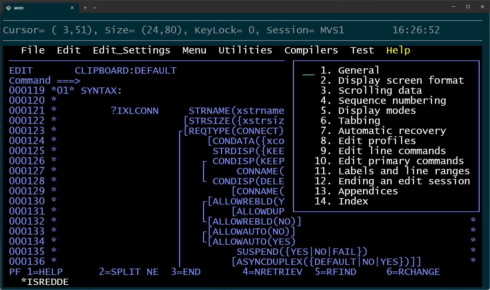
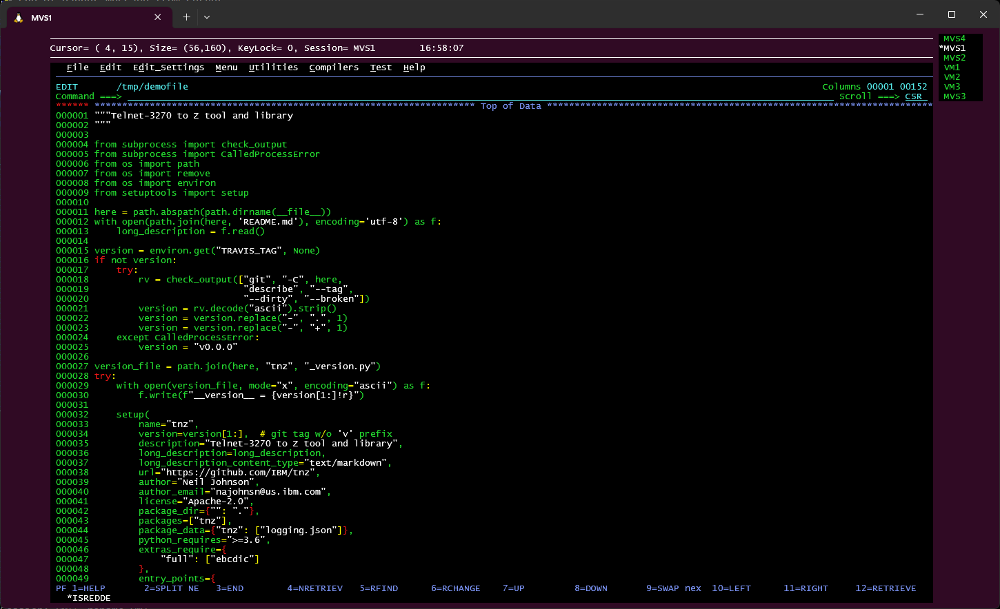

Use a standard terminal emulator as a 3270 terminal interface. 

Write
scripts to automate 3270 terminal interaction.

This is both a 3270
terminal emulator and a Python libary. 

The zti module provides a 3270
user interface through a Windows Command Prompt or a unix/ascii
terminal. 

The tnz module handles the interface to the 3270 data
stream. 

The ati module allows for easier 3270 terminal automation.

#### Features
* Runs on many platforms (including z/OS)
* Secure telnet (TLS) _by default_
* Manages multiple 3270 sessions at the same time
* Lightweight - does not duplicate standard terminal function
* Code page 310 for APL graphic symbols (i.e. 3278T terminal type)

## Installing

Python 3.6 or later is required.
Although not required, on platforms other than z/OS, it is suggested
you also install the [ebcdic](https://pypi.org/project/ebcdic)
package from PyPI.
Use pip to install the latest tnz:
```console
pip3 install ebcdic tnz
```

## Usage
### Automation
See [examples](https://github.com/IBM/tnz/blob/main/examples/) to get started writing a script to automate
3270 interaction.

### Emulator
Run the installed zti (Z Terminal Interface) script to start the
emulator:
```console
zti
```

If your path is not set up for running the installed zti console script,
you can run zti with `python -m tnz.zti` instead.

Starting `zti` takes you into the zti command line interface shell.
Key tab for command completion, up/down for command history.


The `goto` command takes you to a full screen 3270 interface. When
space is available in the terminal screen/window, a status line is
provided as well as a session selector.

The basic syntax of `goto` is: 

```
goto fully-qualified-host-name[:port]
```


In Windows, the Lucida Console font works well with graphic character
APL symbols exploited by ISPF.


Large and arbitrarily-sized screens are supported.


Standard unix/ascii terminals are supported. In the screenshot below,
PuTTY is used as the terminal emulator. The connection was made from
PuTTY to z/OS via ssh and zti is running on z/OS.


The code in this repository aims to be portable. To achieve this, the
number of dependencies is kept to a minimum. The only hard
requirement across platforms is Python and the Python Standard
Library. Though it is likely you will also want additional ebcdic
code pages in order to use your code page of choice (i.e. the ebcdic
package).

#### Emulator Features
* Use Alt+letter to access ISPF menus
* Mouse click sets cursor position
* Mouse double-click sets cursor position and send Enter
* Use any EBCDIC code page available to Python
* Use of code page 310 for APL graphic symbols
* Paste multiline block of text

## Running zti on Windows

The trapping of the keyboard disables keyboard shortcuts documented
in the Control-menu->Edit menu. But the functions can still be
accessed through the Control-menu. For example: mouse click top-left
corner, E (Edit), F (Find) to find text.

**To copy text in Command Prompt, make sure that the Quick Edit Mode
option is selected in the Properties accessed through the
Control-menu. Then you can hold Shift while using the mouse to
select text. Once the text is selected, press Enter to copy the
text.** There are other ways to select text, but I this to be the
easiest.

Do NOT use Control-menu->Edit->Paste to paste text (unless the
text in the clipboard has ONLY printable characters - no line
breaks). Instead, **use Shift+Insert to paste**.

Before establishing a session, get the window sized the way you want
it. Window resizing is not handled well in Windows. If you _do_
resize, just use Esc to get to the command prompt then `goto` to get
back to the session.

Control-menu->Properties will take you to properties for the
terminal. The character size and font can be set. I recommend
**Lucida Console** - it is readable and the graphic symbols are
fairly good at connecting like they are supposed to.


## Documentation

For additional details, see docstrings in source code.

## Contributing
See [CONTRIBUTING.md](https://github.com/IBM/tnz/blob/main/CONTRIBUTING.md).

## Acknowledgments
Hats off to the team responsible for the IBM internal Automated Task
Interpreter (ATI) tool:
Richard Lynch, Karen Eickemeyer, and Ronald Barber.
